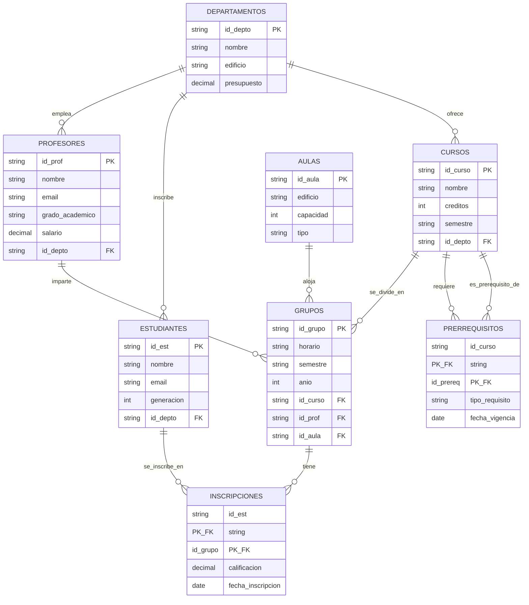

# Sistema de Gestión Universitaria - Álgebra Relacional 🎓

[](https://www.postgresql.org/)
[](https://www.python.org/)
[](https://www.docker.com/)

Proyecto integral que implementa un **Sistema de Gestión Universitaria** demostrando la equivalencia y aplicación práctica entre **Álgebra Relacional**, **Cálculo Relacional de Tuplas**, **Cálculo Relacional de Dominios** y **SQL Estándar**.

El sistema está completamente dockerizado e incluye un menú interactivo en Python para ejecutar y visualizar **20 consultas complejas** que cubren todos los operadores del álgebra relacional.

---

## 👥 Integrantes del Equipo
 
- **Estrada Gónzalez Naomi Judith**
- **Herrera Zaragoza Elizabeth**
- **Romero Martinez Diego Enrique**

---

## 📋 Descripción del Dominio

El proyecto modela el ecosistema completo de una **universidad**, gestionando:

- **Departamentos Académicos**: Organización administrativa con presupuestos y ubicaciones.
- **Profesores**: Personal docente con grados académicos y salarios.
- **Estudiantes**: Registro estudiantil con generaciones y adscripciones departamentales.
- **Cursos**: Oferta académica con créditos y prerrequisitos.
- **Grupos**: Secciones de cursos con horarios, aulas y asignación de profesores.
- **Inscripciones**: Matrícula estudiantil con seguimiento de calificaciones.
- **Aulas**: Infraestructura física clasificada por tipo y capacidad.
- **Prerrequisitos**: Dependencias curriculares entre materias.

---

## 🗂️ Modelo Relacional (Esquema)

### Relaciones Principales

```
DEPARTAMENTOS (id_depto PK, nombre, edificio, presupuesto)
PROFESORES (id_prof PK, nombre, email, grado_academico, salario, id_depto FK)
ESTUDIANTES (id_est PK, nombre, email, generacion, id_depto FK)
CURSOS (id_curso PK, nombre, creditos, semestre, id_depto FK)
AULAS (id_aula PK, edificio, capacidad, tipo)
GRUPOS (id_grupo PK, horario, semestre, anio, id_curso FK, id_prof FK, id_aula FK)
INSCRIPCIONES (id_est FK, id_grupo FK, calificacion, fecha_inscripcion)
PRERREQUISITOS (id_curso FK, id_prereq FK, tipo_requisito, fecha_vigencia)
```

### Cardinalidades y Restricciones

- **1:N** - Un departamento tiene múltiples profesores/estudiantes/cursos
- **N:M** - Estudiantes se inscriben en múltiples grupos (tabla asociativa: `INSCRIPCIONES`)
- **N:M** - Cursos pueden tener múltiples prerrequisitos (tabla asociativa: `PRERREQUISITOS`)
- **1:1** - Un grupo se imparte en un aula específica por semestre

### Datos de Prueba

- **8 tablas** interconectadas
- **100+ tuplas** distribuidas realísticamente:
  - 5 Departamentos
  - 15 Profesores
  - 25 Estudiantes
  - 20 Cursos
  - 10 Aulas
  - 30 Grupos
  - 50+ Inscripciones
  - 15 Prerrequisitos

---

## 📊 Diagrama Entidad-Relación Extendido (EER)


### Descripción de Relaciones

- **DEPARTAMENTOS → PROFESORES** (1:N): Un departamento emplea múltiples profesores
- **DEPARTAMENTOS → ESTUDIANTES** (1:N): Un departamento inscribe múltiples estudiantes
- **DEPARTAMENTOS → CURSOS** (1:N): Un departamento ofrece múltiples cursos
- **PROFESORES → GRUPOS** (1:N): Un profesor imparte múltiples grupos
- **CURSOS → GRUPOS** (1:N): Un curso se divide en múltiples grupos
- **AULAS → GRUPOS** (1:N): Un aula aloja múltiples grupos (en diferentes horarios)
- **ESTUDIANTES ↔ GRUPOS** (N:M): Relación muchos a muchos través de INSCRIPCIONES
- **CURSOS ↔ CURSOS** (N:M): Relación reflexiva a través de PRERREQUISITOS

### Restricciones de Integridad

- **Claves Primarias**: Todas las entidades tienen identificadores únicos
- **Claves Foráneas**: Mantienen integridad referencial entre tablas
- **NOT NULL**: Campos críticos como nombres, emails y fechas
- **CHECK**: Validaciones de dominio (ej: calificación entre 0-10, salario > 0)
- **UNIQUE**: Emails únicos para profesores y estudiantes

## 🧠 Consultas Implementadas (20 Operaciones)

El sistema cubre **todas las operaciones** del álgebra relacional organizadas en 5 categorías:

### 📌 Grupo 1: Operadores Básicos (5 consultas)

| ID | Operador | Descripción |
|----|----------|-------------|
| 1 | **Selección (σ)** | Estudiantes del departamento de ISC |
| 2 | **Proyección (π)** | Nombre y salario de profesores con salario > 40,000 |
| 3 | **Unión (∪)** | Lista unificada de correos electrónicos |
| 4 | **Diferencia (−)** | Cursos sin prerrequisitos asignados |
| 5 | **Producto Cartesiano (×)** | Todas las combinaciones estudiante-curso |

### 🔗 Grupo 2: Operadores de Reunión (5 consultas)

| ID | Operador | Descripción |
|----|----------|-------------|
| 6 | **Reunión Natural (⋈)** | Estudiantes con sus calificaciones (3 tablas) |
| 7 | **Left Outer Join (⟕)** | Todos los departamentos, incluso sin estudiantes |
| 8 | **Theta Join (⋈θ)** | Grupos impartidos por profesores con salario > 40K |
| 9 | **Semi-Join (⋉)** | Estudiantes con al menos una inscripción |
| 10 | **Self Join** | Pares de estudiantes de la misma generación |

### 📊 Grupo 3: Agrupación y Agregación (5 consultas)

| ID | Función | Descripción |
|----|---------|-------------|
| 11 | **AVG** | Promedio de salario por departamento |
| 12 | **COUNT** | Número de estudiantes por departamento |
| 13 | **SUM + HAVING** | Departamentos con presupuesto total > 1,000,000 |
| 14 | **MAX** | Calificación más alta registrada |
| 15 | **COUNT DISTINCT** | Departamentos con cursos asignados |

### ➗ Grupo 4: División (3 consultas)

| ID | Escenario | Descripción |
|----|-----------|-------------|
| 16 | **División ÷ (Caso 1)** | Estudiantes que completaron TODOS los cursos de IA |
| 17 | **División ÷ (Caso 2)** | Estudiantes que completaron TODAS las ciencias básicas |
| 18 | **División ÷ (Caso 3)** | Profesores que impartieron en TODOS los laboratorios |

### 🔍 Grupo 5: Cuantificadores Universales (2 consultas)

| ID | Cuantificador | Descripción |
|----|---------------|-------------|
| 19 | **∀ (Para todo)** | Departamentos donde TODOS los profesores son doctores |
| 20 | **∀ (Para todo)** | Estudiantes que aprobaron TODAS sus materias |

---

## 🎯 Equivalencias Teóricas

Cada consulta se presenta en **4 notaciones equivalentes**:

### Ejemplo: Consulta #1 - Selección

| Lenguaje | Expresión |
|----------|-----------|
| **Álgebra Relacional** | `σ id_depto='ISC' (ESTUDIANTES)` |
| **Cálculo de Tuplas** | `{t \| ESTUDIANTES(t) ∧ t.id_depto = 'ISC'}` |
| **Cálculo de Dominios** | `{<id,n,e,g,d> \| <id,n,e,g,d> ∈ ESTUDIANTES ∧ d = 'ISC'}` |
| **SQL** | `SELECT * FROM estudiantes WHERE id_depto = 'ISC';` |

---

## 📂 Estructura del Repositorio

```
proyecto-algebra-universitaria/
├── docker-compose.yml       # Orquestador de servicios (App + DB)
├── README.md                # Documentación principal (este archivo)
├── app/
│   ├── Dockerfile           # Imagen Python para la aplicación
│   ├── main.py              # Menú interactivo con 20 consultas
│   └── requirements.txt     # Dependencias (psycopg2, tabulate)
└── db/
    └── init.sql             # Script DDL/DML: Creación de tablas y datos
```

---

## 🚀 Instalación y Ejecución

### Prerrequisitos

- **Docker Desktop** (v20.10+) o **Docker Engine + Docker Compose**
- **Git** (para clonar el repositorio)

### Pasos de Instalación

#### 1️⃣ Clonar el repositorio

```bash
git clone https://github.com/TU_USUARIO/proyecto-algebra-universitaria.git
cd proyecto-algebra-universitaria
```

#### 2️⃣ Construir y levantar los contenedores

Este comando descarga PostgreSQL 15, construye la aplicación Python e inicializa automáticamente la base de datos con el esquema y datos de prueba:

```bash
docker-compose up -d --build
```

**Salida esperada:**
```
[+] Running 2/2
 ✔ Container proyecto-db-1   Started
 ✔ Container proyecto-app-1  Started
```

#### 3️⃣ Acceder al menú interactivo

Una vez que los contenedores estén corriendo:

```bash
docker attach proyecto-app-1
```

> **Nota**: Si no aparece el menú inmediatamente, presiona **ENTER** una vez.

#### 4️⃣ Navegar por el menú

```
=== PRACTICA 6, 7 Y 8: Operaciones del Álgebra Relacional ===
--- Básicas ---
1. Selección (σ)
2. Proyección (π)
3. Unión (∪)
4. Diferencia (-)
5. Producto Cartesiano (×)
...
0. Salir
Selección: _
```

Ingresa el número de la consulta que deseas ejecutar. El sistema mostrará:
- La expresión en **Álgebra Relacional**
- La expresión en **Cálculo de Tuplas**
- La expresión en **Cálculo de Dominios**
- El **SQL equivalente**
- Los **resultados** en formato tabla

#### 5️⃣ Detener el sistema

Para apagar los contenedores y liberar recursos:

```bash
docker-compose down
```

---

## 🛠️ Tecnologías Utilizadas

| Tecnología | Versión | Propósito |
|------------|---------|-----------|
| **PostgreSQL** | 15 | Motor de base de datos relacional |
| **Python** | 3.9 | Lenguaje para CLI interactiva |
| **Psycopg2** | 2.9+ | Adaptador PostgreSQL para Python |
| **Tabulate** | 0.9+ | Formateo de tablas en consola |
| **Docker** | 20.10+ | Contenerización y aislamiento |
| **Docker Compose** | 2.0+ | Orquestación multi-contenedor |

---

## 🔧 Solución de Problemas Comunes

### ❌ Error: "puerto 5432 ya está en uso"

**Causa**: PostgreSQL instalado localmente está ocupando el puerto.

**Solución 1** (Recomendada): Detener el servicio local de PostgreSQL:
```bash
# En Linux/Mac
sudo systemctl stop postgresql

# En Windows
net stop postgresql-x64-15
```

**Solución 2**: Cambiar el puerto en `docker-compose.yml`:
```yaml
ports:
  - "5433:5432"  # Usar 5433 en el host
```

### ❌ El menú se cierra inmediatamente

**Causa**: El contenedor de la aplicación se detuvo.

**Solución**:
```bash
# Verificar estado
docker ps -a

# Reiniciar contenedor
docker start proyecto-app-1
docker attach proyecto-app-1
```

### ❌ "Esperando a la BD..." por más de 30 segundos

**Causa**: El contenedor de PostgreSQL no inició correctamente.

**Solución**:
```bash
# Ver logs de la base de datos
docker logs proyecto-db-1

# Reiniciar todo el stack
docker-compose down
docker-compose up -d --build
```

### ❌ Error al construir la imagen Python

**Causa**: Problemas de red o caché corrupta de Docker.

**Solución**:
```bash
# Limpiar caché y reconstruir
docker-compose down
docker system prune -a
docker-compose up -d --build
```
### ❌Error: "init.sql: Is a directory"

**Síntoma**: En los logs aparece `could not read from input file: Is a directory`.
**Causa**: Conflicto de volúmenes en Windows o archivo nombrado incorrectamente (`init.sql.txt`).
**Solución**: Borra la carpeta errónea en `db/`, crea el archivo correctamente y ejecuta `docker-compose down -v`.

 ### ❌Alternativa: Carga Manual de Datos (Workaround)
**Situación**: Si la automatización falla y la base de datos queda vacía.
**Solución**: Inyectar el script manualmente con el contenedor encendido:
```bash
docker cp db/init.sql algebra-relacional-db-1:/tmp/init.sql
docker exec -it algebra-relacional-db-1 psql -U user -d algebra_db -f /tmp/init.sql
```
---